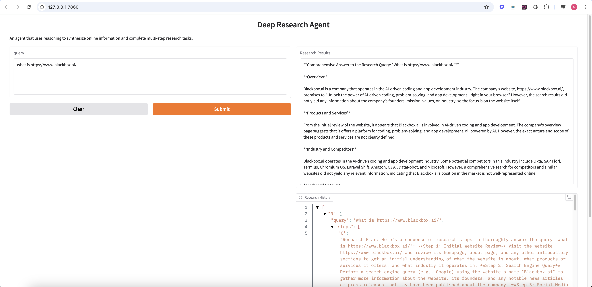

# Deep Research Agent

## Description
The Deep Research Agent is an interactive tool that utilizes reasoning to synthesize online information and complete multi-step research tasks. It leverages external APIs to perform searches and generate responses based on user queries.

When a user submits a query through the Gradio interface, the agent:
- Analyzes the query and generates a research plan
- Breaks down the plan into sequential steps
- For each step, formulates a specific search query
- Uses SerperDevTool to gather relevant information
- Synthesizes the information in the context of the research step
- Maintains a memory buffer with all findings
- Generates a final comprehensive response based on all gathered information

The integration of SerperDevTool with Together.AI models through a reasoning loop creates a powerful research agent capable of handling complex queries. The Gradio interface makes this functionality accessible and testable.

## Installation Instructions
1. Clone the repository:
   ```bash
   git clone https://github.com/nitish571/likedeepsearch.git
   cd likedeepsearch
   ```

2. Create a virtual environment:
   ```bash
   python3 -m venv blackbox
   source blackbox/bin/activate
   ```

3. Install the required packages:
   ```bash
   pip install -r requirements.txt
   ```

4. Create a `.env` file in the root directory and add your API keys:
   ```
   SERPER_API_KEY=<your-serper-api-key>
   TOGETHER_API_KEY=<your-together-api-key>
   ```

## Usage
To run the Deep Research Agent, execute the following command:
```bash
python main.py
```
Open your browser and navigate to the provided local URL to interact with the research agent.

## API Keys
Make sure to set up your API keys in the `.env` file as mentioned in the installation instructions. The application requires valid keys for the following services:
- Serper API
- Together API

## Packages
### Internal

The `perceive` module is designed to gather and process query. This involves meaningful breakdown of the query to generate a research plan, which is then executed step-by-step.

The `reasoning` module contains the logic for breaking down research plan into actionable steps and synthesizing information based on search results.

### Utils
The `utils` package is designed to manage utility functions like calling LLM.

## UI: Deep Research Agent


## License
This project is licensed under the MIT License. See the LICENSE file for more details.
